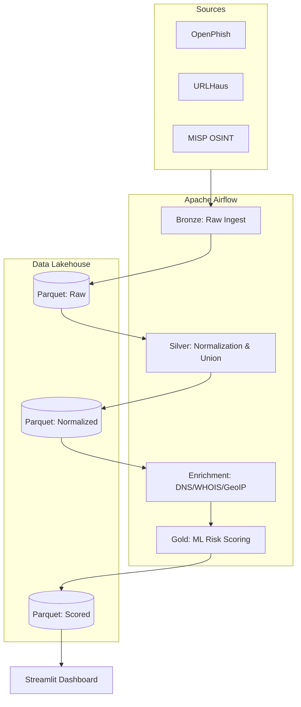

# Threat-Intel: Predictive Domain Intelligence Platform

An Airflow-orchestrated threat intelligence platform that automates the discovery, enrichment, and machine-learning-driven risk scoring of malicious domains in real-time.

## 🚀 Overview

This platform is designed to bridge the gap between reactive security lists and proactive threat hunting. Instead of just ingesting known-bad URLs, this system performs active reconnaissance (WHOIS/RDAP, DNS, GeoIP) and uses a LightGBM classifier to predict the risk level of newly seen infrastructure.

### Key Features
*   **Automated Ingestion**: Live stream processing of OpenPhish, URLHaus, and MISP OSINT feeds.
*   **Infrastructure Recon**: Automated enrichment of domains via recursive DNS and RDAP protocols.
*   **Medallion Architecture**: Data-lake structure (Bronze → Silver → Gold) implemented via Parquet and Airflow.
*   **Predictive Risk Scoring**: Machine learning models (LightGBM & Logistic Regression) trained on historical phishing patterns to score new domains.
*   **Operational Dashboard**: Real-time Streamlit visualization for security analysts to investigate high-risk sightings.

---

## 🏗️ Architecture

The project follows a robust Data Engineering pattern to ensure reliability and scalability:



### Technical Stack
*   **Orchestration**: Apache Airflow (LocalExecutor)
*   **Data Processing**: Python (Pandas), PyArrow
*   **Storage**: Parquet (Partitioned Lakehouse)
*   **Machine Learning**: Scikit-Learn, LightGBM
*   **Visualization**: Streamlit
*   **Environment**: Docker Compose

---

## 🛠️ Reliability & Senior Engineering Patterns

To handle the volatility of live internet data, the platform implements several advanced engineering patterns:
*   **Auto-Healing Retries**: All network-heavy tasks (WHOIS, DNS) implement double-retry policies with exponential backoff to handle transient network blips.
*   **Smart Serialization**: To prevent resource contention on small host environments, heavy resource-consuming tasks are serialized while ingestion remains parallel.
*   **Atomic Persistence**: All data writes use a temp-swap mechanism to ensure Parquet partitions are never corrupted by partial failures.

---

## 🛡️ Privacy & Ethical Considerations

This project is built with **Privacy-by-Design** principles regarding GDPR and CCPA:
1.  **Infrastructure Focus**: The platform targets server-side artifacts (IPs, Domains) rather than personal data.
2.  **Upstream Redaction**: By utilizing the RDAP protocol over legacy WHOIS, we benefit from automated registrant PII redaction provided by international registrars.
3.  **Purpose Limitation**: Data collection is strictly scoped to security research and identifying malicious infrastructure.

---

## ⚡ Quick Start

### Prerequisites
*   Docker & Docker Desktop
*   Python 3.11+

### Installation
1.  Clone the repository:
    ```bash
    git clone https://github.com/mohanasundaramm1/Threat-Intel.git
    cd Threat-Intel
    ```
2.  Initialize the environment:
    ```bash
    cp .env.example .env
    # Add your own API keys if required by MISP/URLHaus
    ```
3.  Launch with Docker:
    ```bash
    docker-compose -f airflow/docker-compose.airflow.yml up -d
    ```
4.  Access the UI:
    *   **Airflow**: `http://localhost:8080`
    *   **Dashboard**: `streamlit run ct/dashboard/ct_dashboard.py`
